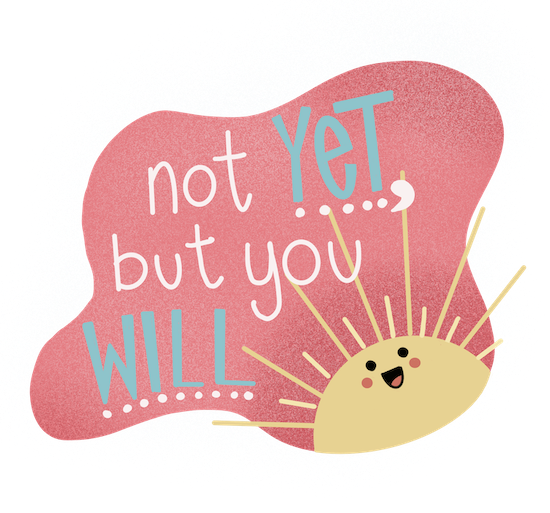

I'm a licensed art educator that is <mark>currently seeking a K&#8211;12 art teaching position in northern Vermont</mark> where I can share my contagious enthusiasm for all things crafty.

 

For the last 20 years I've worked at a chocolate company &#8212; leading demonstrations, teaching classes, and creating retail specialty products. 

I also created [chocolate sculptures](https://chocolatesculptress.com) for display in our stores or local art exhibits. My proudest moments came when one of those sculptures was [featured on the Food Network](https://chocolatesculptress.com/sculptures/cuckoo-clock/ "Giant Chocolate Cuckoo Clock on the Food Network") while another was [selected as part of an exhibit](https://chocolatesculptress.com/sculptures/donut-shop/ "Donut Shop Chocolate Sculpture on display at Shelburne Museum") at the Shelburne Museum.

Working with chocolate has been a blast, but it was time for a change. I've always been grateful for the guidance of my art teachers and how they showed me that I can integreate art into any job. Now I’m hoping I can help kids find their creative spark. ✨

From chocolate to crochet, I'm happiest when working with my hands &#8212; I'm a perpetual doodler, amateur baker, and retro treasure seeker. You'll always catch me laughing at a good pun.



  <h2 class="center">Find me online</h2>
  <ul class="dot-list" role="list">
    <li class="d-flex">
      Design updates
      
      
        <a href="{{ site.social.instagram }}">Instagram</a> or <a href="{{ site.social.dribbble }}">Dribbble</a>
      
    </li>
    <li class="d-flex">
      About my career
      
      
        <a href="resume.pdf" title="View my Resume">Resume (PDF)</a> or <a href="{{ site.social.linkedin }}">LinkedIn</a>
      
    </li>
    <li class="d-flex">
      All things chocolate
      
      
        <a href="https://www.chocolatesculptress.com" title="My chocolate sculpture portfolio">Chocolate Sculptress</a>
      
    </li>
    <li class="d-flex">
      Questions or comments
      
      
        <a href="mailto:emilywjones@gmail.com">Contact me</a>
      
    </li>
  </ul>

